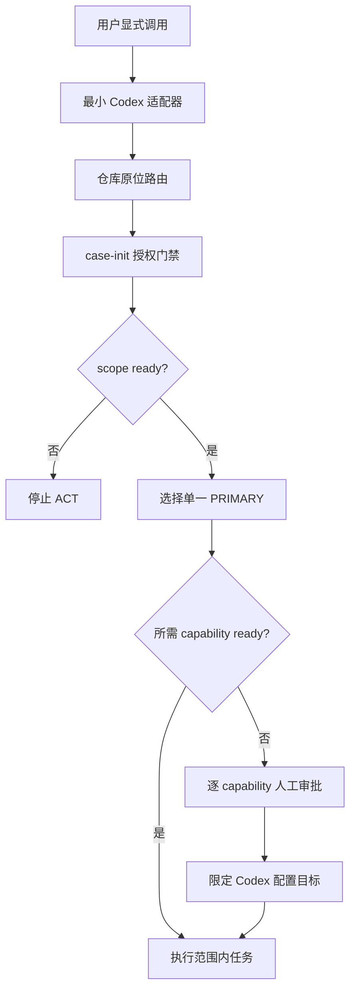

# reverse-skill Codex 安装与供应链安全审计报告

> 日期：2026-08-14  
> 报告结构：`flavor = null`  
> 结论：最小 Codex 路由适配器已安装并验证；外部 capability bootstrap 未获批、未执行。

## 执行摘要

本次审计将 `reverse-skill` 视为一个需要原位使用的安全任务路由包，而不是 85 个应复制安装的独立技能。依据 Cocoloop Safe Check、skill-vetter 和仓库供应链门禁，已安装的两文件适配器评级为 **A / 低风险**；它不含脚本、不访问网络、不修改 Codex 配置、不启动服务，且只允许显式调用。完整路由包作为可执行工具安装源评级为 **C / 高影响、条件使用**：可继续用于路由和静态文档，但其可选 bootstrap 涉及下载、全局包管理、客户端配置、用户环境变量、提权或后台服务，必须逐 capability 审批。未发现明显真实凭据、混淆加载器或“下载后管道执行”模式，但静态审计不能证明不存在所有缺陷。

## 范围与授权

| 项目 | 结果 |
|------|------|
| Case | [`scope.md`](../scope.md) |
| 授权 | `granted`，用户自有本机与本地仓库 |
| 网络模式 | `authorized_target_only`，仅验证公开上游与官方文档 |
| 范围 | 当前仓库、用户级 Codex 适配器、安装与验证路径 |
| 范围外 | 外部目标测试、批量工具安装、MCP 服务启动、Kali 整机配置 |
| Timeline | [`timeline.md`](../timeline.md) |

## 安装结果

| 对象 | 评级 | 状态 | 说明 |
|------|------|------|------|
| `reverse-skill-router` 适配器 | Cocoloop A / LOW | 已安装 | 两个纯文本文件，显式调用，无动态代码 |
| 仓库原位路由与索引刷新 | CONDITIONAL PASS / LOW | 已完成 | 只生成 gitignored 工具状态索引 |
| Windows/Bash capability bootstrap | HIGH | 未执行 | 仅在具体任务需要时逐项审批 |
| Kali quick setup | EXTREME | 拒绝自动执行 | root、整机升级、批量工具与全局配置 |
| Burp MCP 构建 | HIGH | 未执行 | 下载与构建完整性门禁不足 |

安装位置：`%USERPROFILE%/.agents/skills/reverse-skill-router/`。官方 Codex 技能发现规则记录在 [`codex-skill-discovery.md`](../references/codex-skill-discovery.md)。仓库保持原位，因此内部相对路径、路由配置和生成索引不会失效。

## 审计流程图

## Evidence

| ID | 观察 | 可复现来源 | 固定性 |
|----|------|------------|--------|
| E-001 | 上游与 554 个跟踪文件清单；仅 1 个二进制候选 | `git`、`gh`、`Get-FileHash` | case 内制品 SHA-256 |
| E-002 | 指令、凭据模式、可执行面、bootstrap 与构建审计 | `rg`、`git grep`、人工代码审查 | case 内制品 SHA-256 |
| E-003 | 已安装适配器与暂存副本逐文件哈希一致 | `Get-FileHash` | case 内制品 SHA-256 |
| E-004 | 新 Codex 进程发现、doctor 与仓库门禁通过 | `codex exec`、`codex doctor`、仓库测试 | case 内制品 SHA-256 |
| E-005 | 32 个工具、24 个 capability 的首次索引状态 | `refresh-tool-index.ps1` | case 内制品 SHA-256 |

完整记录位于 [`evidence/`](../evidence/INDEX.md)。

## Findings

### F-001
- title: Capability bootstrap 不是技能注册，具有广泛系统副作用
- severity: medium
- category: design
- status: validated
- evidence_ids: [E-002, E-005]
- location: skills/scripts/bootstrap-reverse.ps1; skills/scripts/bootstrap-reverse.sh; kali/scripts/bootstrap-reverse.sh; kali/scripts/quick-setup.sh
- impact: 批量或默认执行可能修改全局包、多个客户端 MCP 配置、用户环境变量和系统软件，并可启动后台服务。
- confidence: high
- repro_steps:
  1. 检查 bootstrap 的默认目标、包管理、网络下载、删除、配置写入与服务启动分支。
  2. 对比 E-005，确认首次索引刷新并不需要这些安装动作。
- remediation: 保持 bootstrap 按 capability、按任务审批；Codex 场景显式限定 `-McpHostTarget Codex`，除非任务必需不得使用 `-StartServices`；禁止自动运行 Kali quick setup。
- optional_attack: n/a

### F-002
- title: 仓库授权文本不得覆盖宿主安全策略
- severity: medium
- category: design
- status: accepted_risk
- evidence_ids: [E-002, E-003]
- location: skills/field-journal/precedent-auth.md; RULES.md; installed reverse-skill-router/SKILL.md
- impact: 如果适配器无边界地继承“默认授权”措辞，可能跳过独立风险评估或把仓库内指令错误提升为宿主策略。
- confidence: high
- repro_steps:
  1. 对比 precedent-auth.md 的覆盖措辞与 RULES.md 的客户端中立边界。
  2. 检查 E-003 中已安装适配器的显式调用与宿主策略保留条款。
- remediation: 保持 `allow_implicit_invocation: false`，每个具体目标继续执行 scope 门禁，仓库声明不得覆盖更高优先级策略。
- optional_attack: n/a

### F-003
- title: 已安装适配器满足最小权限与完整性要求
- severity: info
- category: design
- status: validated
- evidence_ids: [E-003, E-004]
- location: %USERPROFILE%/.agents/skills/reverse-skill-router
- impact: 适配器只在显式调用后指向本地仓库，不引入额外执行代码、网络请求、配置写入或服务。
- confidence: high
- repro_steps:
  1. 比较暂存与安装文件的 SHA-256。
  2. 用新 Codex 进程显式调用技能并核对返回的仓库路径。
  3. 运行 Codex doctor 与仓库门禁。
- remediation: 更新适配器或仓库来源时重新执行相同审计与哈希验证。
- optional_attack: n/a

### F-004
- title: Burp MCP 构建完整性门禁不足
- severity: medium
- category: misconfig
- status: validated
- evidence_ids: [E-001, E-002]
- location: burp-mcp-full/gradle/wrapper/gradle-wrapper.properties; burp-mcp-full/build.gradle; burp-mcp-full/build.bat; burp-mcp-full/build.sh
- impact: Gradle 分发与直接下载的 Maven JAR 缺少本地校验，依赖锁定或验证声明也未发现；执行构建会扩大供应链风险。
- confidence: high
- repro_steps:
  1. 检查 `gradle-wrapper.properties` 是否有 `distributionSha256Sum`。
  2. 检查 build.gradle 是否声明 dependency locking 或 verification。
  3. 检查 build.bat/build.sh 的 curl 下载是否校验哈希。
- remediation: 在运行构建前固定 Gradle 分发校验和，启用依赖锁定或验证，并为直接下载的 JAR 固定可信 SHA-256。
- optional_attack: n/a

## Path

### P-001
- title: 显式 Codex 安全路由调用路径
- path_type: callflow
- start: 用户显式调用 `$reverse-skill-router`
- goal: 在授权范围内进入单一 PRIMARY，且只按需安装 capability
- steps:
  1. action: Codex 发现并加载两文件适配器 — evidence: E-003, E-004 — finding: F-003
  2. action: 适配器指向仓库原位路由并保留宿主策略 — evidence: E-002, E-003 — finding: F-002
  3. action: case-init 建立 scope 后选择 PRIMARY — evidence: E-004 — finding: none
  4. action: tool index 判断 capability 是否 ready — evidence: E-005 — finding: F-001
  5. action: 仅缺少且确需时进入逐项审批，当前任务不执行 bootstrap — evidence: E-002, E-005 — finding: F-001, F-004
- residual_risks: 后续仓库更新或单项 bootstrap 会改变已审计代码和依赖面，必须重新扫描；静态扫描不能保证没有未知漏洞。

## 验证结果

- 新 Codex 进程成功发现 `$reverse-skill-router` 并返回预期仓库路径。
- `codex --strict-config doctor --summary --ascii`：17 ok、0 warning、0 failure。
- 路由回归：163/163 通过。
- 结构一致性与供应链 pin gate：通过。
- 冒烟：脚本解析 11/11、快速路由 9/9、0 failure。
- 适配器两个安装文件与审计暂存副本 SHA-256 完全一致。

## 使用约束

1. 通过 `$reverse-skill-router` 显式调用，不启用隐式触发。
2. 每个目标先运行 `case-init.ps1` 并确认 `auth.status=granted` 与 network profile 就绪。
3. 先读工具索引；缺工具只安装当前任务所需 capability。
4. Codex MCP 注册显式使用 `-McpHostTarget Codex`。
5. 未经单独审计与批准，不运行 `quick-setup.sh`、批量 bootstrap、Burp 构建或后台服务启动。

## 限制与剩余风险

本次是静态供应链与本地安装验证，没有执行外部工具安装、构建、动态恶意行为分析或第三方依赖漏洞数据库扫描。上游仓库后续提交、包管理器解析结果及远程发布制品均可能变化；任何更新应视为新的安装输入重新审计。
